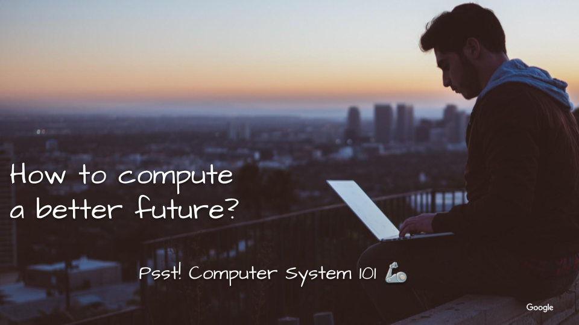

# Gen AI & The Future of SW Development Bootcamp
tl;dr How we may level the playing field for better divested CS talent pipelines.

- [ASD code labs](codelabs.md) are developed as a workshop for
[Google's Code Next](https://codenext.withgoogle.com/). Which works with
high schoolers to cultivate the next generation of Black and Latinx tech leaders.
- It'll continuously develop in open. So that any passionate in bootstrapping CS talent
pipeline in their community can use them.
- Any contribution is welcome. Let's make a dent in the consumer computing universe by getting more started.

## Why
- Expand the future diversified talent pipeline for Tech?
- Making advanced tech concepts like Machine Learning and Large Language Models accessible to high school students	
- Bridging the gap in tech education and fostering a diverse talent pool

### Why Now
Because
- [CS-literacy is a skill in high demand](https://samlin001.medium.com/stay-open-push-forward-a64ef27c91f0).
But the talent gap is widering.
- [The New Age Of Software-Defined](https://samlin001.medium.com/the-new-age-of-software-defined-2ae97c6d3281)
is just getting started.

## How
- Coaches from Tech. to share their CS journeys to share what's like to work in
Tech. & be a role model to inspire high schoolers.
- Introduction to Computer System 101 to show how theories power our digital lives.
- Hands-on projects and practical demonstrations to apply learning in real-world scenarios.

## Key Outcomes
- Foundational understanding of Machine Learning and Large Language Models.
- Experience in building applications using AI technologies.
- Teamwork and problem-solving skills through a mini-project and final presentation.

## Extra Credits and Certifications
Unlock new opportunities and showcase your skills! Our bootcamp offers various certifications and Google Cloud skill badges, providing you with tangible recognition for your hard work and achievements.
- Earn as You Learn: Complete specific modules and projects to earn badges that highlight your skills in AI, ML, and Cloud Computing.
- Certification of Completion: Receive a certificate upon successfully completing the bootcamp, a testament to your dedication and knowledge.
- Step Into the Future: Use these certifications to bolster your academic or professional portfolio, opening doors to further education and career opportunities.

Ready to add some impressive credentials to your name? Dive into our bootcamp and start your journey towards certification!

## Agenda
- Jan 23
	- Inauguration
	- Meet the coaches
- Week 1
	- Machine Learning 101
	- Teachable machine
- Week 2
	- Generative AI 101
	- Practical Applications of Gen AI
- Week 3 & 4
	- AI in Software Development
	- Hands-On with AI-Assisted DevOps
- Week 5
	- Google Generative AI Studios
	- Customizing AI models
- Weeks 6-8
	- Mini-Project Development
- Week 9
	- Project Showcase

## What do students need to join the workshop?
- Ready to join [Google Meet meeting](https://apps.google.com/meet/).
- Ready to [Get started for free](https://cloud.google.com/pricing) for Google
Cloud Platform.
- Sign up for [Github](https://github.com/signup)
- Curious to learn & interst in exploring next-generation computing system
development model.
