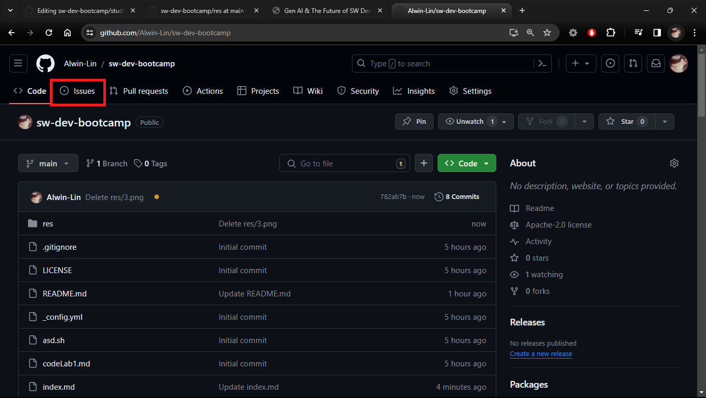

# What problems you can solve with Gen AI?
## How to submit an issue/feature request

## Example 
- [Airport Assistant](https://cloud.google.com/blog/products/databases/introducing-sample-genai-databases-retrieval-app):
  - It can access data such as airports, flights, and local amenities via AlloyDB. Pretend you're a passenger at San Francisco International Airport (SFO); Airport Assistant can help answer questions such as:
    - Where can I get coffee near gate A6?
    - Where can I find a gift for my friend?
    - What flights are headed to New York City tomorrow?
